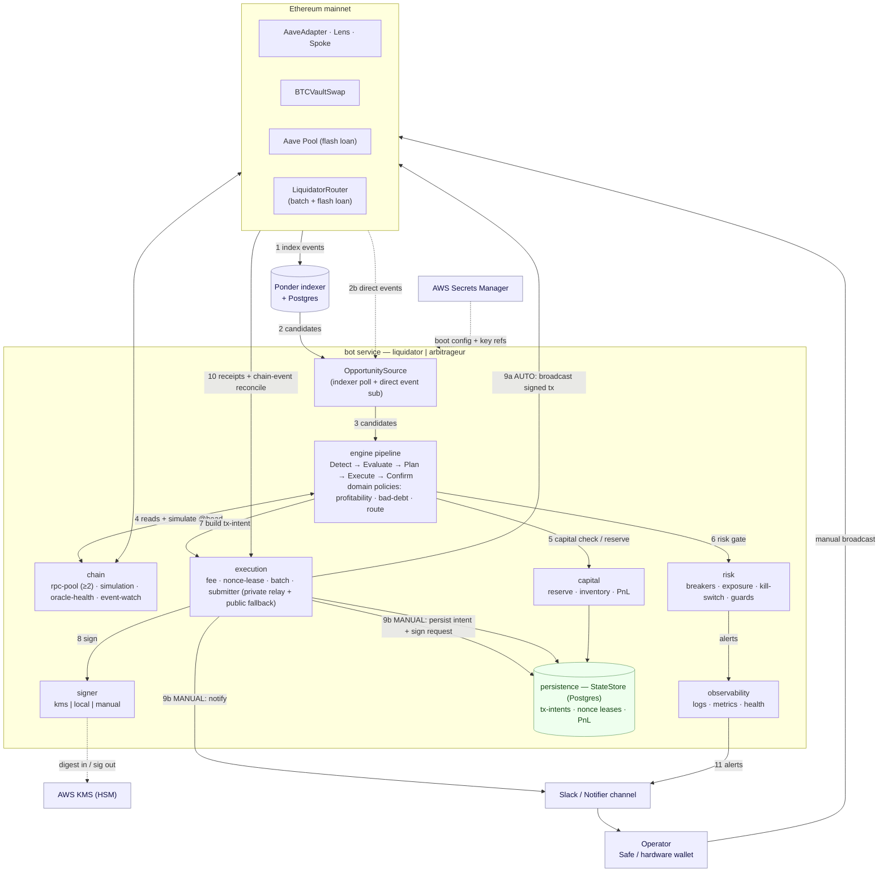

# Production Architecture Proposal — Aave V4 Liquidation & Arbitrage Bots

> Status: Proposal for review. Authored 2026-06-22; revised after two rounds of
> stakeholder feedback and an adversarial design review (see
> [§10 Design decisions & rationale](#10-design-decisions--rationale)).

> **Scope & altitude — this is an architecture proposal, not a final design.** It
> fixes the system boundaries, module decomposition, ports, and the major
> decisions/trade-offs. It deliberately stops short of implementation-grade detail
> for the parts that carry the most risk. **The on-chain contracts
> (`LiquidatorRouter`, `LiquidationRelayer`) and the largest modules (e.g.
> `execution`, `capital`, `chain`) each warrant their own RFC** to settle
> interfaces, invariants, failure modes, and the best concrete approach before
> implementation — the contracts especially, since they are custody-critical and
> audited. Treat the contract signatures, state machines, and config shapes here as
> *illustrative*; the RFCs are where they get pinned down.

## 1. Executive summary

The current repo is a working **prototype**: two polling bots (liquidator,
arbitrageur), each paired with a Ponder indexer, wired with plaintext-env
config, `console.log` logging, ad-hoc nonce management, and per-tx broadcast.
It proves the contract flows but is not production-ready: it cannot recover from
crashes mid-flight, has no capital accounting, no secrets management, no
flash-loan or batching support, and a single RPC/indexer as an unguarded source
of truth.

This proposal refactors it into a **hexagonal (ports-and-adapters) monorepo**
whose core is not generic plumbing but the things that decide whether the system
makes or loses money: **simulation correctness, transaction lifecycle, capital
accounting, batched execution, fee strategy, and circuit breakers**. Two
services — `liquidator` (permissionless) and `arbitrageur` (permissioned,
liquidates *and* arbitrages) — are assembled from shared capability packages.

Target chain is **Ethereum mainnet**. This revision reflects stakeholder
decisions: arbitrageur uses **direct-redemption liquidation only**, flash loans
are **permissionless-liquidator-only (Aave)**, batching means **atomic
multi-position execution**, manual mode is **notify-to-sign (HW wallet + Safe)**,
and MEV is handled as a **tiered strategy** ([§5.7](#57-execution-privacy--mev))
rather than a blanket deferral.

> **MEV / execution privacy — handled in tiers, not deferred wholesale.**
> The original plan deferred *all* MEV work; on Ethereum mainnet that is
> genuinely risky — a permissionless liquidator broadcasting publicly leaks alpha
> (calldata copied/front-run) *and* pays gas on stale, reverting liquidations. So
> we split the work by cost/benefit ([§5.7](#57-execution-privacy--mev)): the
> cheap, high-impact rung — **private transaction submission via a relay**
> (Flashbots Protect / MEV-Blocker), which is a `Submitter` *adapter*
> (an alternate RPC, not a refactor) and also gives **revert protection** — ships
> in **Phase 1**. The genuinely heavy, searcher-grade work (bundle/builder bidding,
> MEV-Share backruns, per-block repricing) stays deferred to §12. Net residual
> risk after Phase 1: **low** for the keeper-gated arbitrageur; for the
> permissionless liquidator, a fair fee-bid race instead of a giveaway.

---

## 2. Current state assessment

| Area | Today | Risk |
|------|-------|------|
| Process model | 2 bots + 2 Ponder indexers, `pnpm` workspace | Liquidator and arbitrageur duplicate logic; no shared engine |
| Discovery | Poll Ponder HTTP every N s, on-chain re-estimate via Lens | Stale/slow; indexer is unguarded truth |
| Execution | Per-tx `writeContract`, manual nonce increment, batch-wait receipts | No replacement/escalation, no idempotency, crash ⇒ double-submit; no atomic batching |
| Secrets | Private key in plaintext `.env` | Unacceptable for prod; no rotation, no HSM |
| Config | Zod (arbitrageur) vs hand-rolled (liquidator) | Drift; inconsistent validation |
| Observability | Prometheus + `/health` `/ready`; `console.log` | No structured logs, no PnL, no alert severity |
| Capital | None | No inventory, allowance, or exposure accounting |
| Flash loans | None | Liquidator must pre-fund debt tokens |
| Batching | None (writes); Multicall3 in indexer reads only | Explicit requirement unmet on write path |
| Modes | Always-auto | No semi-auto / human-in-loop; no bad-debt flag |

**What to keep:** the contract-flow knowledge (Lens-estimate → simulate →
execute), Ponder as a discovery/history source, Multicall3 reads, the
instrumented transport / Prometheus baseline, Docker packaging.

---

## 3. Target architecture (ports & adapters)

### 3.1 Component & data-flow view

Components (boxes) and the runtime data flows between them (numbered edges).
External systems are shaded; the bot service is the subgraph. The same component
graph runs for both services — the `liquidator` emits `liquidateWithLLP`, the
`arbitrageur` emits `liquidate` + `swapWbtcForVault` and runs the extra
`ArbitrageEngine`.



**Data flows**

| # | From → To | What |
|---|-----------|------|
| 1 | mainnet → Ponder | indexer ingests Spoke/Adapter/VaultSwap events |
| 2 / 2b | Ponder → OppSource / mainnet → OppSource | candidate positions & escrowed vaults (poll), plus low-latency direct event subscriptions |
| 3 | OppSource → engine | candidates enter the pipeline |
| 4 | engine ↔ chain | **on-chain truth**: Lens estimate, balances, re-simulate at latest block before any submit |
| 5 | engine → capital | reserve funds/allowance; reject if insufficient (no double-spend) |
| 6 | engine → risk | breakers / exposure / kill-switch gate; trip to `HALTED` on stale data, code-hash mismatch, etc. |
| 7 | engine → execution | hand off a fully-specified `TxIntent` (fees, nonce, deadline, route hash) |
| 8 | execution → signer (→ KMS) | sign; production key stays in the HSM (digest in, signature out) |
| 9a | execution → mainnet | **AUTO**: broadcast via **private relay** (Flashbots Protect / MEV-Blocker) with public fallback + revert protection (§5.7); batches via `LiquidatorRouter` |
| 9b | execution → StateStore + Notifier → operator | **MANUAL**: canonical intent persisted (hash-verified in `operator-cli`); Slack only signals; operator signs via Safe/HW and broadcasts |
| 10 | mainnet → execution → StateStore | receipts + reconcile in-flight state from chain events (crash-safe) |
| 11 | risk/observability → Slack | severity-routed alerts (stuck funds, tripped breaker, pending manual tx) |

> The `engine` orchestrates the pipeline but does **not** hide the
> route-specific state machines (LLP-liquidation, direct-redemption,
> vault-acquisition) — each has its own validated transitions inside `Plan`/`Execute`.

### 3.2 Module / dependency view

```
              ┌─────────────────────────── services (composition roots) ───────────────────────────┐
              │   liquidator             arbitrageur             operator-cli                       │
              └───────────────────────────────────┬──────────────────────────────────────────────┘
                                                   │ depends on
        ┌──────────────────────────────────────────────────────────────────────────────────────┐
        │  engine   (orchestration; imports PORT interfaces only)                                 │
        └───────────────────────────────────┬──────────────────────────────────────────────────┘
                                             │
   ┌─────────────┬─────────────┬─────────────┼─────────────┬─────────────┬─────────────────────┐
   │   domain    │    chain     │  execution  │   capital   │    risk     │    observability    │
   │ (pure, no IO)│ rpc-pool ·  │ tx-intents· │ reserve ·   │ breakers ·  │ logging · metrics · │
   │ opportunities│ simulation ·│ fee · nonce·│ inventory · │ exposure ·  │ health              │
   │ profitability│ oracle ·    │ batch ·     │ allowances ·│ kill-switch·│                     │
   │ bad-debt ·   │ event-watch │ submitter · │ pnl         │ guards      │ config (zod)        │
   │ route plan   │             │ manual·recpt│             │             │                     │
   └─────────────┴─────────────┴──────┬──────┴─────────────┴─────────────┴─────────────────────┘
                                       │ via PORT interfaces (root exports = types only)
   ┌───────────────────────────────────────────────────────────────────────────────────────────┐
   │  pluggable integration packages — one seam each (port + adapter subdirs):                    │
   │    secrets {aws,env,(gcp)}  ·  signer {kms,local,manual}  ·  notifications {slack}            │
   │    indexer {ponder}  ·  persistence {postgres}                                               │
   └───────────────────────────────────────────────────────────────────────────────────────────┘
   ┌───────────────────────────────────────────────────────────────────────────────────────────┐
   │  contracts:  LiquidatorRouter (batch + Aave flash-loan, ONE audit)                           │
   └───────────────────────────────────────────────────────────────────────────────────────────┘

   Dependency direction is one-way ↓.  Adapters are imported ONLY in service composition roots.
   domain imports nothing; engine imports port interfaces only. (CI-enforced — see below.)
```

### 3.3 Package layout

We keep the existing **`services/`** naming and the **`liquidator`** /
**`arbitrageur`** service names.

```
services/
  liquidator/            # permissionless: LLP liquidation, self-funded or Aave flash-loan
    client/              #   the bot process
    ponder/              #   indexer (existing)
  arbitrageur/           # permissioned: direct-redemption liquidation + escrowed-vault acquisition + redemption lifecycle
    client/
    ponder/
  operator-cli/          # canonical manual tx-intent review/sign/submit; renders to HW wallet or Safe

packages/
  domain/                # opportunity models, profitability, bad-debt rules, route planning, prioritization (no IO)
  engine/                # LiquidationEngine, ArbitrageEngine (orchestrate route state machines over ports)
  chain/                 # viem readers, lens client, multicall, simulation, rpc-pool, event watchers, oracle health
  execution/             # tx-intents, fee strategy, nonce leases, batch executor, submitter (private relay + public fallback), manual executor, receipts, replacement
  capital/               # balances, allowances, inventory, escrow lifecycle, capital reservation, PnL
  risk/                  # circuit breakers, exposure limits, stale-data checks, kill switch, route + token guards
  config/                # zod schemas + env/secret loading (replaces hand-rolled liquidator config)
  observability/         # structured logging, prometheus metrics, health/ready (absorbs today's packages/shared server+health)

  # pluggable integrations — one package per seam; each owns its PORT + adapters in subdirs:
  secrets/               # SecretsProvider port  ·  ./aws  ./env  (./gcp later)
  signer/                # Signer port           ·  ./kms  ./local  ./manual (notify→HW/Safe)
  notifications/         # Notifier port         ·  ./slack  (./telegram, ./pagerduty later)
  indexer/               # OpportunitySource port·  ./ponder
  persistence/           # StateStore port       ·  ./postgres

contracts/
  LiquidatorRouter/      # permissionless: batch liquidateWithLLP + Aave flash-loan in ONE audited contract (see §5.4)
                         # KeeperRouter is intentionally NOT here — arbitrageur batches via sequenced txs (§5.4)
```

### 3.4 Adapter organization (addressing the "broad `adapters` package")

Instead of one grab-bag `adapters` package, **each external seam is its own
package** owning *both* its port interface and its implementations in
subdirectories. The port type is exported from the package root; each adapter is
exported via a subpath so the core depends only on the interface, never on
adapter code or its transitive deps (e.g. the AWS SDK):

```ts
// packages/secrets/package.json → "exports": { ".": "./src/port.ts", "./aws": "./src/aws/index.ts", "./env": "./src/env/index.ts" }
import type { SecretsProvider } from "@repo/secrets";        // interface only — no AWS SDK pulled in
import { AwsSecretsProvider }   from "@repo/secrets/aws";    // adapter, wired only in the composition root
```

**Dependency rules (enforced in CI, not just documented)** — co-locating port +
adapters is only clean if the boundaries are *mechanically* enforced; otherwise
it becomes the old grab-bag with subpath cosmetics:

- `domain` imports **no** ports and no IO.
- `engine` imports port **interfaces only** (root exports), never adapter subpaths.
- Each integration package's **root export is type/interface-only** — it must not
  import the AWS SDK, Slack SDK, Postgres client, etc.
- **Adapters are imported only in service composition roots** (`services/*/client`).
- No adapter package may depend back on `engine`/`domain`.
- Enforce with `dependency-cruiser` or `eslint-plugin-boundaries` in CI.

### 3.5 Key port interfaces (illustrative)

```ts
interface ChainReader  { getBlock(); call(); multicall(); getCode(); /* served by rpc-pool */ }
interface Signer       { address(): Address; sign(intent: TxIntent): Promise<SignedTx>; }   // kms | local | manual
interface Submitter    { send(signed: SignedTx, policy: SubmitPolicy): Promise<TxHandle>; } // private relay (default) | public fallback; bundle later
interface OpportunitySource { liquidatable(): AsyncIterable<Candidate>; escrowedVaults(): ...; }
interface SecretsProvider   { get(ref: SecretRef): Promise<Secret>; }                       // aws | env | gcp
interface Notifier     { notify(event: AlertEvent): Promise<void>; }                        // slack | ...
interface StateStore   { reserveNonce(); recordIntent(); transition(); reconcile(); }       // postgres
```

> **Design note (from review):** the executor is **not** a thin port. It is a
> subsystem: fee bidding, nonce leasing, replacement, batched submission,
> public/private routing, receipt tracking, reconciliation, and intent expiry.
> Treating it as a one-method interface is the most common way these bots
> silently lose money.

---

## 4. The two services & shared liquidation engine

The requirement — *"arbitrageur is standalone but must also liquidate"* — is met
by **two deployable services sharing role-gated capability modules**, not one
config-heavy binary and not a runtime "role" switch.

| Capability | `liquidator` (permissionless) | `arbitrageur` (permissioned) |
|------------|:-----------------------------:|:----------------------------:|
| LLP liquidation (`liquidateWithLLP`) | ✅ | — |
| Direct-redemption liquidation (`liquidate`, registered BTC key) | — | ✅ |
| Escrowed-vault acquisition (`swapWbtcForVault`) | — | ✅ |
| BTC redemption lifecycle tracking (~3-day challenge) | — | ✅ |
| Flash-loan funded liquidation (Aave) | ✅ | — |
| Atomic multi-position batching (router) | ✅ | — (sequenced batch, §5.4) |
| Bad-debt liquidation (operator flag) | ✅ (opt-in) | ✅ (opt-in) |
| Working-capital controls | debt-token + WBTC inventory | WBTC + escrow + expected-BTC inventory |
| Keeper registration / permissions | ✗ | ✅ |
| Manual mode (notify-to-sign) | optional (slow paths) | ✅ primary for capital actions |

Both services consume the same `LiquidationEngine`, parameterized by which
adapter call it emits (`liquidateWithLLP` vs `liquidate`). The arbitrageur
additionally runs `ArbitrageEngine`. Separate processes give independent blast
radius, independent keys/IAM roles, independent scaling, and a clean security
boundary — a permissionless hot key must never share identity with a registered
keeper that custodies WBTC.

---

## 5. Required-feature designs

### 5.1 Secrets management (AWS first, decoupled)
- `secrets` package: `SecretsProvider` port with `./aws` and `./env` (dev/local
  only) adapters; `./gcp` later — no core changes to add it.
- **Signing key is special** and lives in the `signer` package, not `secrets`.
  Production signing uses an **AWS KMS secp256k1 key** via `./kms` — the private
  key never leaves the HSM; the bot sends a digest and receives a signature.
  Secrets Manager protects key *storage*, not key *use at runtime*; a raw key in
  process memory is exfiltratable. `./local` (raw key) is dev/test/emergency only.
- **KMS hot-path specifics to implement** (commonly under-done): `MessageType=DIGEST`
  signing, DER signature decoding, recovery-id derivation, **low-s
  normalization** (EIP-2), a bounded signing queue, and explicit behavior on KMS
  latency spikes (replacements still need fast signing even though batching cuts
  signature count).
- Least privilege: separate IAM roles and KMS keys per service; key rotation;
  allowance/approval changes gated.

### 5.2 Operating modes (auto / manual)
Two modes only — **`AUTO`** and **`MANUAL`** — selectable per strategy.

> **On removing `DISABLED`:** redundant. "Don't run this strategy" is just
> *not enabling it* in config (`strategy.enabled = false`), and "stop executing
> now" is the **kill-switch / circuit-breaker** — a *runtime safety state*
> (`HALTED`), not a user-selected operating mode. So: modes = {AUTO, MANUAL};
> HALTED is produced by risk controls (§7).

- **AUTO** — the bot signs and broadcasts (the time-sensitive liquidation path).
- **MANUAL (semi-automated)** — the bot detects, evaluates, simulates, and builds
  a fully-specified `TxIntent`, then a human signs & submits. Primarily for the
  **arbitrageur**, which custodies WBTC.
  - **Canonical intent lives in `StateStore`** (with a content hash), surfaced via
    `operator-cli`. The **`Notifier` only sends a notification + reference/hash**,
    never the raw signable payload as the source of truth — Slack is a notification
    channel, not a secure transaction transport. The operator verifies the hash in
    `operator-cli` before signing.
  - **Signing paths:** **hardware wallet** (operator signs the rendered intent in
    `operator-cli`) and **Safe** (intent posted as a Safe proposal for multisig
    approval). `signer/manual` abstracts both.
  - Intents **expire** (deadline block) and are **always re-simulated immediately
    before broadcast** — a liquidation approved minutes late can be toxic.
- **Bad-debt flag** — a `domain` policy widening the candidate filter to HF<1
  positions where collateral < debt (protocol-protective, often unprofitable).
  Off by default, separate exposure limits, typically routed to MANUAL.

### 5.3 Flash-loan support — permissionless liquidator only
- Applies to the **`liquidator`** only (the arbitrageur uses working capital, §7).
- Implemented **inside `LiquidatorRouter`** (the same audited contract as
  batching, §5.4): flash-borrow the debt token from the **Aave v4 pool** →
  `liquidateWithLLP` → receive WBTC at the sell discount → swap WBTC→debt token
  (slippage-bounded) → repay loan + premium → keep residual. Atomic; revert
  leaves no exposure. **One flash loan funds an entire batch.**
- `domain` route planner chooses **SelfFunded vs FlashLoan** by config + live
  balance + post-swap, post-premium profitability.
- Aave only for now. A generic `FlashLoanProvider` seam (Balancer/Morpho) is
  **not built until the Aave route works** — see §12.

### 5.4 Transaction batching — atomic multi-position execution
"Batching" means **liquidate many positions in one transaction**. Because the
`AaveAdapter` pulls tokens from `msg.sender`, batching across positions needs a
thin **router contract** that holds approvals, loops, and isolates per-item
failure — a plain Multicall3 (whose `msg.sender` would be Multicall3) cannot
carry the liquidator's funds.

- **Liquidator (committed):** `LiquidatorRouter` — **one audited contract** with
  both `batchLiquidate(orders[], allowFailure, AggregateGuard)` (self-funded) and
  a flash-loan entrypoint wrapping the same batch. Batching and flash loans ship
  in **one audit pass** to avoid auditing the same router twice and changing
  interfaces under live approvals.
  - **`allowFailure` must not silently erode profit.** Each item emits a per-item
    result event and the router enforces an **aggregate min-profit / max-loss
    guard** in the same tx — otherwise dropped items can turn a profitable batch
    into a losing one.
- **Arbitrageur (sequenced, not a router):** vault acquisition and direct
  redemption are **keeper-gated** — routing them through a contract would require
  the router itself to be the registered keeper, and acquisitions aren't a
  competitive race (capital is locked for days), so an audited `KeeperRouter` is
  **not worth the risk**. Default = **sequenced submission with nonce leases**
  (many txs, one cycle, idempotent). Revisit only if the deployed contracts prove
  a contract keeper / `onBehalfOf` delegation is supported and there's measured
  value.
- **Read batching via Multicall3** (Lens estimates, balances, allowances,
  previews, oracle reads) — already partly present in the indexer; ships Phase 1.
  See the note below for what it is and why it matters.
- **Always re-simulate the assembled batch** at the latest block before submit.
- Router is fork- and invariant-tested, minimal token approvals, with a rescue path.

### 5.5 Liveness & infra accuracy (RPC / indexer)
- **RPC pool** with health-gated failover and **provider diversity** — at least
  two *independent* providers/backends, not multiple URLs to the same one. Quorum
  reads for critical pre-broadcast state only.
- **Indexer is a candidate source, not truth.** Dual-source: Ponder for
  discovery/history/backfill + dashboards; direct event/log subscriptions for the
  low-latency hot path; on-chain Lens/preview as final truth before planning.
- Guards: indexed-head-vs-chain-head lag check, stale-oracle detection,
  RPC-disagreement detection, **reorg policy by action type** (shallow
  confirmation depth for liquidations vs the multi-day BTC redemption lifecycle),
  candidate invalidation keyed by block number, watchdog heartbeat.
- **Always re-simulate at latest block immediately before broadcast.**

### 5.6 Notifications (Slack first, decoupled)
- `notifications` package: `Notifier` port; `./slack` first, pluggable
  (`./telegram`, `./pagerduty` later).
- Doubles as the **manual-mode signal** (§5.2): tx-to-sign *notifications* go
  through `Notifier`, but the canonical signable intent lives in `StateStore` —
  Slack is not the source of truth.
- **Severity routing matters more than the channel:** page on stuck funds /
  tripped breaker / kill-switch / inventory imbalance / pending manual tx; don't
  alert on every opportunity (fatigue hides the real incident).

### 5.7 Execution privacy & MEV (refines the earlier "defer MEV" decision)

MEV protection is not all-or-nothing. The mitigations form a cost/benefit
ladder; the cheapest rung is near-free on mainnet and removes most of the risk,
so it ships in Phase 1, while genuine searcher-grade infrastructure stays
deferred. This is a deliberate refinement of the earlier blanket deferral, which
carried two concrete mainnet costs: **alpha leakage** (public calldata copied /
front-run) and **gas burned on stale, reverting liquidations**.

**Exposure by actor / path** — most paths here are *not* a public auction:

| Path | Public-mempool exposure | Mitigation |
|------|-------------------------|------------|
| Permissionless `liquidateWithLLP` | **High** — deterministic discount profit; anyone can copy the calldata and outbid gas | **L0** (Phase 1) |
| Flash-loan repayment AMM swap leg | **High** — sandwichable | L0 + slippage/deadline (Phase 2–3) + **L1** |
| Arbitrageur `swapWbtcForVault` | **~None** — keeper-gated; only registered keepers can call | none needed |
| Arbitrageur direct `liquidate` | **Low** — copyable only by other registered keepers (small set) | L0 optional |
| Arbitrageur WBTC sourcing via AMM (if ever introduced) | High — sandwichable | L0 + slippage |

**Mitigation ladder**

- **L0 — Private transaction submission + profit-capped fees (Phase 1, near-free).**
  Route `eth_sendRawTransaction` through a private endpoint (Flashbots Protect,
  MEV-Blocker, or a builder's private RPC) instead of the public mempool. This is
  a `Submitter` *adapter* — an alternate transport URL, not a rewrite — and it:
  - removes public-mempool visibility ⇒ kills copy/front-running of the
    liquidation tx and sandwiching of any swap leg (private txs aren't seen);
  - gives **revert protection** (these endpoints drop reverting txs ⇒ **no gas
    paid on stale liquidations**) — a correctness/cost win independent of MEV;
  - pairs with **profit-capped priority-fee bidding** and slippage + deadline on
    swaps.
  Public submission stays a configurable **fallback** (low-value/non-competitive
  opportunities, or relay outage).
- **L1 — Bundle submission + builder payment (Phase 2–3).** For atomic batches and
  the flash-loan route: construct bundles, pay builders via priority fee /
  coinbase transfer sized to expected profit, fan out to multiple builders, and
  rely on all-or-nothing inclusion. Warranted once value-per-tx is high enough
  that a single private tx leaves money on the table.
- **L2 — Searcher-grade (deferred, §12).** MEV-Share backruns, per-block
  opportunity repricing, private-orderflow auctions, advanced multi-relay routing.
  Genuinely heavy; correctly deferred.

**Decision rule (chain has a relay × actor × public swap leg):** on mainnet a
relay exists, so — permissionless liquidator ⇒ **L0 always**; any path with a
public AMM swap leg ⇒ **L0 + slippage/deadline**, escalate to L1 when value is
material; permissioned arbitrageur with no swap leg ⇒ L0 optional, public is
acceptable.

> **Why this is still cheap:** L0 is one adapter behind the `Submitter` port plus
> a fee policy — no new infrastructure, no contracts. It is the ~80/20 of MEV
> defense. Only L1/L2 (the part that actually needs searcher tooling) stays in
> §12.

---

## 6. Transaction lifecycle (the real core)

A persisted state machine in `persistence` (`StateStore`), with idempotency keys
(`chain · block · account · collateral · debt · route`):

```
PLANNED → RESERVED(nonce,capital) → SIGNED → SUBMITTED → {MINED|REVERTED|REPLACED|EXPIRED|ORPHANED} → RECONCILED
                                          │
                              MANUAL: → AWAITING_SIGNATURE → (operator signs/submits) → SUBMITTED
```

- **Nonce leases** (not naive increment) so concurrent strategies and restarts
  never collide or strand the sequence.
- **Block-bound validity on every intent:** deadline block, max base fee, max
  priority fee, and a post-simulation **route hash** so an intent can't execute
  against drifted state/fees.
- **Replacement/escalation** for stuck txs; cancel logic.
- A **reconciliation loop** that rebuilds in-flight state **from chain events**
  (not just local receipts) on startup/interval, preventing double-submit after a
  crash and catching txs mined while the bot was down.
- Manual intents are first-class rows so a restart never loses an
  awaiting-signature tx.

---

## 7. Capital, risk & accounting

- **Capital:** per-asset balances, **allowance model** (per-router + per-token
  caps, no infinite approvals unless explicitly accepted, separate approvals for
  self-funded vs flash-loan paths, an allowance monitor, and an emergency-revoke
  procedure), inventory states, **capital reservation** so two opportunities
  can't double-spend the same WBTC/debt token, **operator-configurable exposure
  limits** (each arbitrageur operator sets working-capital size, max per-position
  size, max concurrent locked capital), locked-capital accounting across the
  ~3-day escrow/redemption window.
- **Risk / circuit breakers → `HALTED`:** stale indexer, stale RPC, stale oracle
  (with a documented oracle dependency map: source, heartbeat, deviation,
  freeze behavior), abnormal revert rate, **unexpected contract code hash /
  address registry mismatch** for any protocol dependency, profit-below-threshold,
  gas-above-ceiling, reorg depth, inventory imbalance.
- **Token guard:** decimals, non-standard ERC-20 return values, fee-on-transfer
  denial, approval-reset behavior.
- **Kill switch:** remotely disable auto execution without redeploy.
- **PnL:** realized vs unrealized, gas, failed-tx costs, BTC redemption proceeds,
  inventory marks — **reconciled against chain events**, not only local receipts.

---

## 8. Configuration model

### 8.1 Principles

- **Layered, validated, fail-fast.** A single typed config is assembled at boot
  and validated with **Zod** (unifying today's split: Zod arbitrageur vs
  hand-rolled liquidator). The process refuses to start on any invalid/missing
  value.
- **Precedence:** built-in defaults → versioned config file (per env/service) →
  environment-variable overrides → resolved secret references. Later layers win.
- **Secrets are *references*, never literals.** Anything sensitive (signing key,
  RPC API keys, DB password, Slack webhook, keeper BTC key, kill-switch token) is
  stored as a `secretRef` resolved at boot via the `SecretsProvider` (`aws` in
  prod, `env` for local dev). The config file itself is safe to commit.
- **Scopes:** *shared* keys (network, secrets, observability) → *per-service*
  (role, signer, contracts, flash-loan) → *per-strategy* (mode, economics,
  bad-debt). One service can run several strategies, each with its own mode and
  thresholds.

A `secretRef` is a small object the `SecretsProvider` knows how to resolve, e.g.
`{ secretRef: "aws:sm:prod/liquidator/rpc-alchemy" }` (AWS Secrets Manager) or
`{ secretRef: "env:LIQUIDATOR_PRIVATE_KEY" }` (dev). Swapping AWS→GCP changes only
`secrets.provider` and the ref scheme — no code changes.

### 8.2 Worked example — `liquidator` (annotated)

```yaml
# config/liquidator.prod.yaml — non-sensitive, version-controlled.
service:
  role: liquidator              # liquidator | arbitrageur — selects capabilities (§4)
  instanceId: liq-mainnet-1     # tags logs/metrics; part of idempotency keys (§6)
  logLevel: info                # debug | info | warn | error
  logFormat: json

network:
  chainId: 1
  rpc:                          # RPC pool for liveness/accuracy (§5.5)
    providers:                  # ≥2 INDEPENDENT backends, not 2 URLs to one
      - { url: { secretRef: aws:sm:prod/liq/rpc-alchemy },   weight: 1 }
      - { url: { secretRef: aws:sm:prod/liq/rpc-quicknode }, weight: 1 }
    quorumForCriticalReads: 2   # N providers must agree on pre-broadcast state
    requestTimeoutMs: 5000
    maxRetries: 3
  multicall3Address: "0xcA11bde05977b3631167028862bE2a173976CA11"  # read batching

secrets:
  provider: aws                 # aws | env | gcp — which backend resolves secretRefs
  region: us-east-1

signer:                         # how txs are signed (§5.1)
  type: kms                     # kms | local(dev) | manual
  kms: { keyId: { secretRef: aws:sm:prod/liq/kms-key-arn }, region: us-east-1 }
  expectedAddress: "0xLiq..."   # boot assert: resolved signer must equal this

contracts:                      # on-chain addresses (validated as addresses)
  adapter:   "0x..."            # AaveAdapter
  lens:      "0x..."            # AaveAdapterLens
  spoke:     "0x..."
  vaultSwap: "0x..."            # BTCVaultSwap (LLP)
  wbtc:      "0x..."
  aavePool:  "0x..."            # flash-loan source (§5.3)
  liquidatorRouter: "0x..."     # batch + flashloan (Phase 2+)
  debtTokens: auto              # auto-discover from Spoke, or explicit [0x..,0x..]

indexer:                        # OpportunitySource (§5.5)
  url: http://liquidator-ponder:42069
  pollIntervalMs: 3000
  maxHeadLagBlocks: 3           # reject candidates if indexer trails chain head > N
  eventSubscription: true       # direct WS hot-path (Phase 2)

strategies:                     # one block per strategy; each independently moded
  llpLiquidation:
    enabled: true
    mode: AUTO                  # AUTO | MANUAL (§5.2)
    minProfitUsd: 25            # skip opportunities below this (after gas + fees)
    maxPositionsPerCycle: 25
    badDebt:                    # operation flag for underwater positions (§5.2)
      enabled: false
      mode: MANUAL
      maxLossUsd: 0             # protocol-protective cap when intentionally taking loss

execution:                      # tx assembly + submission (§5.4, §6)
  batch:
    enabled: true               # atomic multi-position via router (Phase 2)
    maxBatchSize: 10
    allowFailure: true          # per-item isolation
    aggregateMinProfitUsd: 50   # whole-batch floor so dropped items can't net a loss
  fees:
    maxBaseFeeGwei: 60
    maxPriorityFeeGwei: 5
    profitCapBps: 5000          # never bid more than 50% of expected profit
    deadlineBlocks: 3           # intent expiry / block-bound validity (§6)
  nonce: { strategy: lease }    # persisted nonce leases, not naive increment
  replacement:
    enabled: true
    escalationBps: 1250         # bump fees ~12.5% per replacement of a stuck tx
    maxReplacements: 3
  txReceiptTimeoutMs: 120000

mev:                            # execution privacy (§5.7) — L0 in Phase 1
  submission: private           # private | public
  privateRelay:
    url: https://rpc.flashbots.net   # or MEV-Blocker / a builder's private RPC
    revertProtection: true      # don't include reverting txs ⇒ no gas on stale liq
  publicFallback: true          # fall back for low-value opps / relay outage

flashLoan:                      # liquidator-only (§5.3) — Phase 3
  enabled: false
  provider: aave
  routeSelection: auto          # auto | selfFunded | flashLoan
  maxPremiumBps: 9

capital:                        # operator-configurable (§7)
  reservation: true             # reserve funds per opportunity (no double-spend)
  exposure:
    maxConcurrentInflightUsd: 50000
    maxPerPositionUsd: 20000
  allowances:
    mode: capped                # capped | infinite (infinite must be explicit)
    perTokenCapUsd: 100000

risk:                           # circuit breakers + kill switch (§7) → HALTED
  breakers:
    maxRevertRatePct: 25        # rolling window
    maxGasGwei: 150
    oracleMaxStalenessSec: 3600
    maxReorgDepth: 5
    codeHashRegistry: true      # halt if a dependency's deployed code hash changes
  killSwitch:
    enabled: true
    source: { secretRef: aws:sm:prod/liq/killswitch }  # remote toggle, no redeploy

notifications:                  # decoupled (§5.6)
  provider: slack               # slack | telegram | pagerduty | ...
  webhookRef: { secretRef: aws:sm:prod/liq/slack-webhook }
  severityRouting:
    page: [stuck_funds, breaker_tripped, kill_switch, manual_tx_pending]
    info: [liquidation_success, daily_pnl]

observability:
  metricsPort: 9090             # Prometheus + /health + /ready

persistence:                    # StateStore (§6)
  database: { url: { secretRef: aws:sm:prod/liq/db-url }, schema: public }
```

### 8.3 `arbitrageur` deltas

The arbitrageur shares the same schema; only the role-specific keys differ:

```yaml
service.role: arbitrageur
signer.type: kms                # custodies WBTC — KMS strongly recommended
contracts.btcRedeemKey: { secretRef: aws:sm:prod/arb/keeper-btc-key }  # registered keeper key
strategies:
  directLiquidation:            # arbitrageur liquidates via direct redemption only (§4)
    enabled: true
    mode: AUTO
    isDirectRedemption: true
    minProfitUsd: 50
  vaultAcquisition:             # the arbitrage half
    enabled: true
    mode: MANUAL                # human-approved capital deployment (notify-to-sign §5.2)
    maxSlippageBps: 100         # over current Hub debt
    minMarginBps: 50            # skip escrowed vaults below this margin
flashLoan.enabled: false        # N/A — arbitrageur uses working capital (§5.3)
mev.submission: public          # keeper-gated; private optional (§5.7)
capital.exposure.maxConcurrentLockedUsd: 250000   # bounds WBTC locked over ~3-day redemption
```

### 8.4 Config groups at a glance

| Group | What it controls | Contains secrets? |
|-------|------------------|:-----------------:|
| `service` | role (capability set), identity, logging | no |
| `network.rpc` | provider pool, quorum, timeouts — liveness/accuracy (§5.5) | URLs/keys |
| `secrets` | which backend resolves every `secretRef` | no |
| `signer` | signing mechanism: KMS / local / manual (§5.1) | key in KMS |
| `contracts` | on-chain addresses; debt-token discovery; keeper BTC key | btcRedeemKey |
| `indexer` | opportunity source + staleness guard (§5.5) | no |
| `strategies.*` | per-strategy mode (AUTO/MANUAL), economics, bad-debt flag (§5.2) | no |
| `execution` | batching, fees, nonce leases, replacement (§5.4, §6) | no |
| `mev` | private vs public submission + relay (§5.7) | relay url (opt) |
| `flashLoan` | liquidator funding route, provider, premium cap (§5.3) | no |
| `capital` | reservation + operator exposure/allowance limits (§7) | no |
| `risk` | circuit-breaker thresholds + kill switch (§7) | killswitch token |
| `notifications` | channel + severity routing (§5.6) | webhook |
| `observability` | metrics/health port, log format | no |
| `persistence` | StateStore database | db url |

> Today's flat env vars (`LIQUIDATOR_PRIVATE_KEY`, `CLIENT_RPC_URL`,
> `ADAPTER_ADDRESS`, `POLLING_INTERVAL_MS`, …) map onto this tree and keep working
> as `env:`-scheme overrides/secret refs, so migration is incremental rather than
> a hard cutover.

---

## 9. Phased delivery plan

Each phase ships both services where applicable. Required features (1–7) tagged.

**Phase 1 — MVP, money-safe core (no custom contracts)**
- `liquidator`: LLP liquidation, **self-funded single-position**, Ponder +
  mandatory on-chain re-validation, **Multicall read batching + planning
  batches**, AUTO path, fee strategy + nonce lifecycle store, **private-relay
  submit (Flashbots Protect / MEV-Blocker) with public fallback + revert
  protection + profit-capped fee bidding (L0, §5.7)**, unified Zod config,
  structured logs, Prometheus, basic Slack alerts, core circuit breakers + kill switch.
- `arbitrageur`: escrowed-vault discovery, `previewEscrowedVaults`,
  `swapWbtcForVault`, direct-redemption liquidation, **sequenced batching via
  nonce leases**, WBTC + escrow + expected-BTC inventory, **MANUAL notify-to-sign**
  with canonical intent in `StateStore`.
- Features: **(1)** two services/shared engine · **(3)** AUTO/MANUAL, bad-debt
  off · **(5)** read + planning + sequenced batching · **(6)** lag/health/re-sim
  + breakers + provider diversity · **(7)** Slack · **MEV L0** private submission.

**Phase 2 — Secrets, contract batching + flash loans, hardening**
- **(2)** AWS Secrets Manager + **KMS** signer (low-s, DIGEST, recovery-id, queue);
  rotation; allowance manager.
- **(4)+(5)** **One audited `LiquidatorRouter`** delivering self-funded
  **atomic batch** liquidation *and* the **Aave flash-loan** route together
  (fork + invariant tests, aggregate profit/loss guard, rescue path); SelfFunded↔
  FlashLoan route selection.
- **(3)** Safe + hardware-wallet signing via `operator-cli`; full bad-debt policy.
- **(6)** direct event subscriptions alongside Ponder; RPC-disagreement checks;
  oracle dependency map + code-hash/address registry guards.
- **(7)** Slack severity routing + operator actions.
- Priority-fee escalation + tx replacement policy.
- **MEV L1**: bundle submission + builder payment for the router/flash-loan path,
  with slippage + deadline guards on the swap leg (§5.7).

**Phase 3 — Scale & optimize**
- Advanced capital optimizer; PnL/accounting reports; keeper redemption lifecycle
  automation; `secrets/gcp` adapter; additional flash-loan venues
  (Balancer/Morpho) behind a `FlashLoanProvider` seam; **MEV L2** (MEV-Share
  backruns, per-block repricing, multi-relay) (§12); incident-runbook automation.

> Combining batching + flash loans into one `LiquidatorRouter` audit (Phase 2) is
> deliberate: they are the same contract, so splitting them across phases would
> mean auditing it twice and mutating interfaces under live approvals.

**Phase 1 caveats (must be explicit to stakeholders):**
- **Hard requirement (5), *atomic* multi-position batching, is fully satisfied in
  Phase 2, not Phase 1.** Phase 1 delivers read + planning + sequenced batching
  only; the atomic router lands with the Phase-2 audit.
- **Phase 1 is not production custody for serious funds.** It uses local/`env`
  keys; KMS arrives in Phase 2. Either pull KMS forward, or run Phase 1 only
  under an explicit **limited-capital / canary rollout** (small balances, tight
  exposure caps) until KMS is live.

---

## 10. Design decisions & rationale

Resolved through adversarial review + stakeholder feedback:

| # | Question | Decision | Why |
|---|----------|----------|-----|
| 1 | One binary vs two services vs role switch | **Two services, shared role-gated modules**; `services/` naming kept | Independent blast radius, keys/IAM, scaling; clean permissionless-vs-keeper boundary |
| 2 | KMS vs raw key in memory | **KMS secp256k1 in prod** (low-s/DIGEST/recovery-id), raw key dev-only | Secrets Manager protects storage, not runtime use |
| 3 | Arbitrageur liquidation path | **Direct-redemption only** (`liquidate`); LLP is permissionless-only | Arbitrageur is a registered keeper; LLP is for non-keeper liquidators |
| 4 | Operating modes | **AUTO + MANUAL only**; HALTED is a runtime safety state | `DISABLED` conflated config with kill-switch |
| 5 | Manual mode mechanism | **Canonical intent in StateStore**, notify-to-sign; HW wallet + Safe via `operator-cli` | Slack isn't a secure tx transport; operator controls WBTC custody |
| 6 | Flash loans | **Permissionless liquidator only, Aave first** | Arbitrage value realizes after ~3-day redemption; can't repay a same-tx loan |
| 7 | Batching | **Liquidator: one router (batch+flashloan, one audit). Arbitrageur: sequenced txs** | Adapter pulls from `msg.sender`; keeper-gating makes a KeeperRouter risky for no race |
| 8 | Indexer trust | **Dual-source**: Ponder candidates + direct subs + on-chain truth | HTTP poll alone is too stale |
| 9 | Adapter org | **One package per seam** (port + adapters), **CI-enforced boundaries** | Clean dep graph; subpath cosmetics alone would rot |
| 10 | MEV / private orderflow | **Tiered (§5.7):** L0 private submission ships Phase 1 (near-free, ~80/20 of the risk); L1 bundle/builder Phase 2–3; L2 searcher-grade deferred to §12 | Blanket deferral leaked alpha + paid gas on stale liquidations; L0 removes most of that for one adapter |

---

## 11. Resolved inputs

1. **Target chain:** Ethereum mainnet.
2. **Batching:** atomic multi-position (liquidate many positions at once).
3. **Manual mode:** support HW wallet *and* Safe; first iteration = notify the
   configured channel to sign & submit; operator handles signing.
4. **Flash-loan venue:** Aave first; others later.
5. **Capital model:** operator-configurable per arbitrageur.

---

## 12. Future improvements

- **MEV L2 — searcher-grade execution (the only MEV tier deferred here).** L0
  (private submission) ships Phase 1 and L1 (bundle/builder payment) Phase 2–3
  (§5.7); what remains for later is the genuinely heavy work: MEV-Share backruns,
  per-block opportunity repricing, private-orderflow auctions, and advanced
  multi-relay routing. Builds on the same `Submitter` port — no refactor.
- **Additional flash-loan venues** (Balancer, Morpho) behind a `FlashLoanProvider`
  seam — only after the Aave route is proven.
- **GCP secrets/KMS** adapters.
- **EIP-7702 EOA batching** once mainnet tooling is solid (an EOA-side
  alternative to the router).
- **Advanced capital optimizer** (cross-opportunity allocation, inventory rebalancing).

---

## 13. Production standards checklist (Ethereum mainnet)

Concrete items mature liquidator/keeper operators treat as table stakes:

- **Fork tests against mainnet state** for every route and router change.
- **Bundle/trace simulation**, not just `eth_call`, before broadcast.
- **Oracle dependency map:** source, stale thresholds, heartbeat/deviation,
  freeze behavior — and what the bot does during an oracle freeze.
- **Code-hash / address registry** for every protocol dependency, checked at boot
  and as a breaker.
- **Token-weirdness policy:** decimals, non-standard returns, fee-on-transfer,
  approval-reset.
- **Allowance caps** per router/token + emergency revoke.
- **Reorg policy by action type** (liquidation confirmation depth vs BTC
  redemption lifecycle).
- **RPC provider diversity** (≥2 independent backends).
- **Incident runbooks:** stuck nonce, bad approval, router paused, KMS failure,
  indexer lag, oracle stale, relay outage.
- **Accounting reconciliation against chain events**, not only local receipts.

---

## 14. Top 5 ways this loses money (ranked)

1. **Stale / incorrect simulation** — repay debt and receive less than expected,
   bad slippage, or revert after paying gas. *Fix: simulate at latest block,
   block-bound validity (deadline + max fees + route hash), re-validate
   immediately before submit.*
2. **Broken capital accounting** — double-reserve funds, run dry, over-allocate
   to delayed BTC redemption, ignore locked capital. *Fix: reservations,
   inventory states, operator exposure limits, chain-reconciled PnL.*
3. **Nonce / tx-lifecycle bugs** — duplicate nonce, stuck tx blocks the bot,
   underpriced replacement, crash ⇒ double-submit. *Fix: persisted nonce leases,
   tx state machine, idempotency keys, chain-event reconciliation.*
4. **Unsafe router / batching** — one stale item, missing aggregate profit guard,
   over-broad approval, flash-loan route leaves no profit. *Fix: one audited
   router, per-item events + aggregate guard, fork + invariant tests, minimal
   approvals.*
5. **Alpha leakage / fee leakage (permissionless liquidator)** — public calldata
   copied/front-run, swap leg sandwiched, gas overpaid, gas burned on stale
   reverting liquidations. *Fix: MEV **L0 private submission + revert protection**
   in Phase 1 (§5.7), slippage + deadline on swaps; L1 bundles + L2 searcher-grade
   later.*
```
