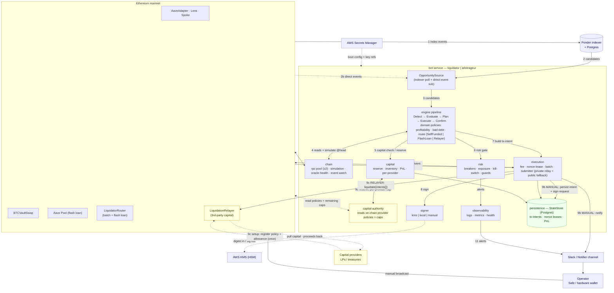

# Addendum (proposed diffs) — `Relayer` funding route

> This file collects the *diffs* that integrate the payer-relayer idea into the
> existing docs.
>
> **Key framing:** RELAYER is **not** a third operating mode next to AUTO/MANUAL.
> It's a third value on the *funding* axis (sibling to `SelfFunded` / `FlashLoan`),
> selected by the `domain` route planner. AUTO/MANUAL stays a clean two-value axis.
>
> **What it's for:** non-custodial funding — external LPs / treasuries fund
> liquidations without handing the operator custody; trust shifts from *operator
> opsec* to *an audited contract*. The planner picks `Relayer` for that case;
> single-operator, self-funded liquidations stay `SelfFunded` / `FlashLoan`.
>
> **Authorization model — Model A (on-chain policy + allowance), the default.**
> Each provider registers a **capped policy + ERC-20 allowance** to
> `LiquidationRelayer` **once**, from their own wallet/Safe. The bot then executes
> liquidations automatically within that policy; the contract enforces every bound
> and routes proceeds back. There is **no per-liquidation signature**, so
> liquidations stay fast. `capital-authority` is a **chain reader** of those
> policies — no intake endpoint, no separate relayer service. (Escalation to
> per-intent signatures + a standalone relayer service is noted in §5.16.)
>
> Two genuinely new pieces — the `LiquidationRelayer` **contract** and the
> `capital-authority` **port**; everything else is additive. AUTO/MANUAL untouched.

---

# A. `production-architecture-proposal.md`

## Diff 1 — §3.1 Component & data-flow view (replace the mermaid block)

Replace the existing `flowchart TB` block with this (additions vs the current
diagram: the `LiquidationRelayer` contract, the external `Capital providers`, the
`capital-authority` port, and route **9c**):

````md

````

Add to the **Data flows** table:

```diff
 | 11 | risk/observability → Slack | severity-routed alerts ... |
+| 9c | providers → relayer / capital-authority → execution → mainnet | **RELAYER**: providers register a capped on-chain policy + allowance to `LiquidationRelayer` once; `capital-authority` reads those policies + remaining caps; `capital` reserves per-provider; `execution` submits `liquidate(intents[])` via the private relay; the contract enforces bounds, pulls provider capital, routes proceeds back. Hot key stays untrusted; no per-liquidation signature. |
```

## Diff 2 — §3.2 Module / dependency view (add the package + contract)

```diff
   │  pluggable integration packages — one seam each (port + adapter subdirs):                    │
   │    secrets {aws,env,(gcp)}  ·  signer {kms,local,manual}  ·  notifications {slack}            │
-  │    indexer {ponder}  ·  persistence {postgres}                                               │
+  │    indexer {ponder}  ·  persistence {postgres}  ·  capital-authority {on-chain policies}      │
   └───────────────────────────────────────────────────────────────────────────────────────────┘
   ┌───────────────────────────────────────────────────────────────────────────────────────────┐
-  │  contracts:  LiquidatorRouter (batch + Aave flash-loan, ONE audit)                           │
+  │  contracts:  LiquidatorRouter (batch + Aave flash-loan)  ·  LiquidationRelayer (3rd-party capital)  │
   └───────────────────────────────────────────────────────────────────────────────────────────┘
```
> Note: re-pad the box borders (`│` alignment) after applying — the added text
> widens both rows.

## Diff 3 — §3.3 Package layout (add the package + contract)

```diff
   indexer/               # OpportunitySource port·  ./ponder
   persistence/           # StateStore port       ·  ./postgres
+  capital-authority/     # CapitalAuthority port  ·  reads external providers' on-chain policies + caps (§5.16)

 contracts/
   LiquidatorRouter/      # permissionless: batch liquidateWithLLP + Aave flash-loan in ONE audited contract (see §5.4)
                          # KeeperRouter is intentionally NOT here — arbitrageur batches via sequenced txs (§5.4)
+  LiquidationRelayer/    # non-custodial third-party capital: enforces each intent against a provider's
+                         # on-chain policy, pulls within allowance, routes proceeds back (§5.16). Prefer a Safe-module variant.
```

## Diff 4 — §3.5 Key port interfaces (add the port)

```diff
 interface StateStore   { reserveNonce(); recordIntent(); transition(); reconcile(); }       // postgres
+interface CapitalAuthority { providers(): Promise<ProviderPolicy[]>; remainingCap(p: Address): Promise<bigint>; } // reads on-chain policies + allowances; no signature intake
```

## Diff 5 — §5.3 Flash-loan support (add the route)

```diff
 - `domain` route planner chooses **SelfFunded vs FlashLoan** by config + live
   balance + post-swap, post-premium profitability.
+- **`Relayer` route** — a third funding route for **non-custodial third-party
+  capital**: providers register a **capped on-chain policy + allowance** to a
+  `LiquidationRelayer` contract (once, from their own wallet/Safe); the bot then
+  executes liquidations automatically within that policy, the contract enforces
+  every bound on-chain and routes proceeds back. A *funding route*, not an
+  operating mode (it composes with AUTO). No per-liquidation signature (Model A);
+  `capital-authority` reads policies from chain. See §9 (Phase 3) and the relayer
+  addendum. Single-operator funding stays SelfFunded/FlashLoan.
 - Aave only for now. A generic `FlashLoanProvider` seam (Balancer/Morpho) is
   **not built until the Aave route works** — see §12.
```

## Diff 6 — §8.2 config (contracts + strategy block)

```diff
   liquidatorRouter: "0x..."     # batch + flashloan (Phase 2+)
+  liquidationRelayer: "0x..."   # 3rd-party capital route (Phase 3, §5.16)
   debtTokens: auto              # auto-discover from Spoke, or explicit [0x..,0x..]
```
```diff
   llpLiquidation:
     enabled: true
     mode: AUTO                  # AUTO | MANUAL (§5.2)
+    funding: selfFunded         # selfFunded | flashLoan | relayer (§5.16)
     minProfitUsd: 25
```

## Diff 7 — §9 Phase 3 delivery (add the deliverable)

```diff
 **Phase 3 — Scale & optimize**
 - Advanced capital optimizer; PnL/accounting reports; keeper redemption lifecycle
   automation; `secrets/gcp` adapter; additional flash-loan venues
   (Balancer/Morpho) behind a `FlashLoanProvider` seam; **MEV L2** ...
+- **`Relayer` funding route — non-custodial third-party capital.** A
+  `LiquidationRelayer` contract (or Safe module) + a `CapitalAuthority` port.
+  Providers register a capped on-chain policy + allowance (Model A); the bot
+  executes within it automatically — external LPs / treasuries fund liquidations
+  **without handing the operator custody** (trust shifts from operator opsec to an
+  audited contract). A *funding route* (sibling to SelfFunded/FlashLoan, §5.3)
+  composing with AUTO — **not** an operating mode. Most custody-critical contract
+  in the system → separate audit; prefer a Safe-module variant.
```

## Diff 8 — §10 Design decisions (new decision row)

```diff
 | 10 | MEV / private orderflow | **Tiered (§5.7):** L0 ... deferred to §12 | ... |
+| 11 | Pooled / third-party liquidation capital | **`Relayer` funding route, not a new mode; Model A (on-chain policy)** | `onBehalf` + capped float / flash loans cover single-operator custody; the relayer's unique benefit is *non-custodial* pooling of external capital. On-chain policy keeps liquidations fast (no per-action signature). Orthogonal to AUTO/MANUAL → a route in `domain` (Phase 3) |
```

---

# B. `production-architecture-modules.md`

## Diff 9 — intro (register the new seam)

```diff
 3. **Integration packages** (one external seam each: port + adapters) —
-   `secrets`, `signer`, `notifications`, `indexer`, `persistence`
+   `secrets`, `signer`, `notifications`, `indexer`, `persistence`,
+   `capital-authority` *(§5.16)*
```

## Diff 10 — §5.1 `domain` (route planner)

```diff
 - **Route planner** — chooses SelfFunded vs FlashLoan from config + live balance +
-  **post-swap, post-premium** profitability. (Execution lives in
-  `contracts`/`execution`; the *choice* is pure.)
+  **post-swap, post-premium** profitability — plus **`Relayer`** (§5.16) when
+  liquidations are funded by non-custodial third-party capital (picks a provider
+  with remaining on-chain cap). (Execution lives in `contracts`/`execution`; the
+  *choice* is pure.)
```

## Diff 11 — §5.4 `execution` (Detail — batching)

```diff
 - **Read batching via Multicall3**; **re-simulate the assembled batch** before
   submit.
+- **`Relayer` route** — when the planner picks `Relayer`, the executor assembles a
+  `LiquidationRelayer.liquidate(intents[])` call against a provider's on-chain
+  policy; nonce leases, fee strategy, private submission and pre-broadcast re-sim
+  are **unchanged** (it's just another route target). Provider policies + caps are
+  read from chain via the `capital-authority` port (§5.16) — no per-liquidation
+  signature, no intake service.
```

## Diff 12 — new §5.16 (after §5.15 `operator-cli`)

```diff
+---
+
+## 5.16 `contracts/LiquidationRelayer` + `capital-authority` — non-custodial third-party capital
+
+Lets external LPs / treasuries fund liquidations **without handing the operator
+custody**. Providers register a **capped on-chain policy + ERC-20 allowance** to
+`LiquidationRelayer` once (from their own wallet/Safe); the bot then executes
+liquidations automatically within that policy, the contract enforces every bound
+and routes proceeds back to the provider. Authorization is a **standing on-chain
+policy (Model A)** — not a per-action signature — so liquidations stay fast. Trust
+shifts from *operator opsec* to *an audited contract*. **Not a new operating
+mode** — a funding route (sibling to SelfFunded/FlashLoan, §5.1/§5.3) that composes
+with AUTO. The planner picks it for pooled/external capital; single-operator
+funding stays SelfFunded/FlashLoan (a capped hot float or flash loans serve those
+better).
+
+<details><summary>Detail — contract, port & risk</summary>
+
+- **Provider setup (once, from their own wallet/Safe):** register a policy
+  `(maxPerPosition, minProfitBps, approvedAssets, totalCap, expiry)` + an ERC-20
+  allowance to `LiquidationRelayer`. No further provider involvement per action.
+- **`LiquidationRelayer.liquidate(intents[])`** — each intent is `(provider, user,
+  debt, route)`; the contract checks it against the provider's on-chain policy,
+  pulls ≤ remaining cap from the provider, executes, routes proceeds back.
+- **Relayer (`msg.sender`) is untrusted** — it can only execute policy-satisfying,
+  proceeds-to-provider liquidations; a leaked relayer key yields at worst bounded
+  griefing within the policy (the `minProfitBps` / approved-asset bounds cap loss),
+  never theft or redirection.
+- **`capital-authority` port** (new seam) — **reads** on-chain provider policies +
+  remaining caps; no signature store, no intake endpoint. `capital` reserves
+  per-provider against remaining caps so opportunities don't double-spend a
+  provider.
+- **Most custody-critical contract in the system** → its own audit. Prefer a
+  **Safe-module** variant over bespoke custody code where feasible.
+- **Escalation (only if needed):** relaying for many independent providers, a
+  permissionless/standalone relayer, or providers requiring per-action approval →
+  split a **standalone relayer service** and switch to **Model B** (per-intent
+  EIP-712 signatures with an intake endpoint, `liquidate(intents[], signatures[])`).
+  Model B reintroduces per-opportunity provider latency; Model A is the default.
+</details>
```

---

## Why these are *all* the touch points

| Module / file | Change | New vs reused |
|---|---|---|
| §3.1 / §3.2 / §3.3 / §3.5 layout | diagram + `capital-authority` package + `LiquidationRelayer` contract + port | layout only |
| `domain` route planner | add `Relayer` as a route value | small addition |
| `contracts/LiquidationRelayer` | new custody-critical contract (or Safe module) | **new** |
| `capital-authority` port | new seam — **reads** on-chain provider policies | **new** |
| `execution` | assemble `liquidate(intents[])`; lifecycle untouched | reused |
| `capital` | per-provider reservation/attribution | small addition |
| `risk` | staleness + per-provider caps | reused |
| `config` | `liquidationRelayer` address + `strategies.*.funding` key | small addition |

Two genuinely new pieces (the contract and the `capital-authority` port);
everything else is additive. AUTO/MANUAL untouched. No separate relayer service
under Model A.
